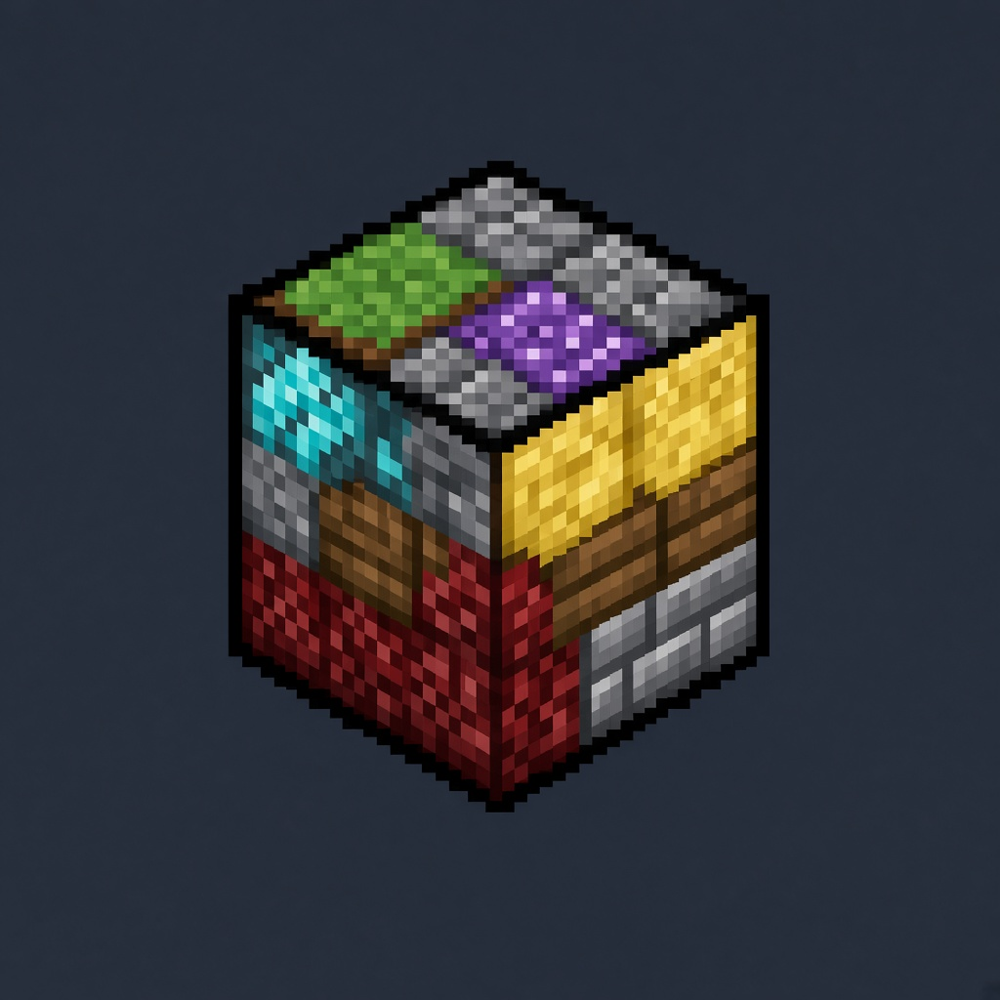

# Block Shuffle



Fabric mod for Minecraft 1.21.1. Solid blocks become random. Air, water, and lava are left alone.

Nothing changes when a world is created. Choose a scale, pregenerate terrain if you need it, then start it with a command.

The layout is derived from the world seed. Each dimension has its own layout: the same coordinates in the Overworld and the Nether do not produce the same block. Running the command again with the same seed and the same scale produces the same layout.

Commands require permission level 2.

## Order of commands

### 1. Choose a scale

The scale is stored in the dimension where you run the command. The following launch command copies that scale onto every selected dimension.

| Command | Result |
|---------|--------|
| `/blockshuffle scale 1` | each block on its own |
| `/blockshuffle scale 2` | 2×2×2 cubes |
| `/blockshuffle scale 4` | 4×4×4 cubes |
| `/blockshuffle scale 8` | 8×8×8 cubes |
| `/blockshuffle scale 16` | 16×16×16 cubes |
| `/blockshuffle scale chunk` | one random block for the whole chunk |
| `/blockshuffle scale biome` | one random block for the whole biome |

`scale 1` uses the full block pool. Larger scales, `chunk`, and `biome` use ordinary stable blocks only. A cube of chests or beehives would create thousands of block entities.

On `biome`, the replacement border follows the biome border. Each separate patch of a biome gets its own block: two plains with forest between them are different, while one continuous plain stays one block. Cave biomes are separate, because the game stores a biome for every 4×4×4 region.

### 2. Pregenerate terrain if you need it

Skip this step when the chunks already exist. `pregen` only creates chunks around the spawn of the **current** dimension. It does not replace blocks. Run it again from inside the Nether and the End if those dimensions should be filled in too.

```
/blockshuffle pregen 32
```

`32` is the radius in chunks, so the square is 65×65. Wait until the chat says pregeneration is finished, then start the replacement.

A radius of 500 is about a million chunks. That runs for hours in the background.

### 3. Start the replacement

The command finds every chunk already saved in the selected dimensions and replaces it again, including chunks the mod has processed before. Progress is printed in chat. Chunks created after the command are replaced when you reach them.

| Command | Dimensions |
|---------|------------|
| `/blockshuffle` | Overworld, Nether, and End |
| `/blockshuffle all` | the same |
| `/blockshuffle overworld` | Overworld only |
| `/blockshuffle both` | Nether and Overworld |
| `/blockshuffle nether` | Nether only |

A later command narrows the set. After `all`, running `overworld` stops new chunks in the Nether and the End from changing.

## Examples

An already generated world. Every chunk is one random block, in all three dimensions:

```
/blockshuffle scale chunk
/blockshuffle all
```

The same, but each biome is one random block:

```
/blockshuffle scale biome
/blockshuffle all
```

Pregenerate a square around the Overworld spawn, then replace every saved chunk in all three dimensions with 4×4×4 cubes:

```
/blockshuffle pregen 32
/blockshuffle scale 4
/blockshuffle all
```

Overworld only, by chunk. The Nether and the End stay vanilla:

```
/blockshuffle scale chunk
/blockshuffle overworld
```

Nether and Overworld, without the End:

```
/blockshuffle scale chunk
/blockshuffle both
```

Replace blocks only around yourself, without queueing the whole world. The radius is in blocks, maximum 32:

```
/blockshuffle around 8
```

## Other commands

| Command | Effect |
|---------|--------|
| `/blockshuffle scale` | show the current scale |
| `/blockshuffle border 32` | vanilla world border, radius in chunks from spawn |
| `/blockshuffle auto` | show whether new chunks are randomized in this dimension |
| `/blockshuffle auto false` | stop randomizing new chunks in this dimension |
| `/blockshuffle auto true` | turn that back on |
| `/blockshuffle pool` | full pool size, and whether a crafting table and a bee nest are included |

`border` sets the vanilla world border. The mod does not add its own barrier.

## Which blocks can appear

The full pool contains every registered block that has a normal item form: full cubes, crafting tables, beehives, containers, workstations, sand, stairs, slabs, plants, and compatible blocks from other mods.

Excluded blocks are portals, barriers, command blocks, structure blocks, bedrock, internal technical states, and blocks that assemble a multiblock creature on their own: carved pumpkins, jack o'lanterns, and wither skeleton skulls.

At `1×1×1`, shaped blocks are uncommon and block entities such as hives and chests are rare. If a block from another mod crashes on placement, it is quarantined and replaced with stone.

## Requirements

- Minecraft 1.21.1
- Fabric Loader
- Fabric API

## Install

Build the mod and put `build/libs/block-shuffle-1.3.6.jar` in the `mods` folder.

For Prism Launcher, use a Minecraft 1.21.1 instance with Fabric API. Put the JAR in `mods` and restart the game.

## Build

JDK 21 is required.

```bat
gradlew.bat build
```

## License

[MIT](LICENSE). Copyright (c) 2026 MegaDaniilak.

---

# Block Shuffle

Fabric-мод для Minecraft 1.21.1: твёрдые блоки становятся случайными. Воздух, вода и лава не трогаются.

После создания мира ничего не меняется само. Сначала выбирается размер замены, при необходимости мир прогружается, и только потом команда запускает замену.

Раскладка считается от сида мира. В каждом измерении она своя: одинаковые координаты в Верхнем мире и Нижнем мире не дают одинаковый блок. Повторный запуск с тем же сидом и тем же масштабом даёт ту же раскладку.

Команды доступны с правом OP уровня 2.

## Порядок действий

### 1. Выбрать размер

Размер запоминается в мире, где выполнена команда. Когда следом запускается замена, этот размер копируется на все выбранные измерения.

| Команда | Что получается |
|---------|----------------|
| `/blockshuffle scale 1` | каждый блок сам по себе |
| `/blockshuffle scale 2` | кубики 2×2×2 |
| `/blockshuffle scale 4` | кубики 4×4×4 |
| `/blockshuffle scale 8` | кубики 8×8×8 |
| `/blockshuffle scale 16` | кубики 16×16×16 |
| `/blockshuffle scale chunk` | весь чанк — один случайный блок |
| `/blockshuffle scale biome` | весь биом — один случайный блок |

`scale 1` использует полный пул блоков. Крупные размеры, чанк и биом берут только обычные устойчивые блоки: куб из сундуков или ульев создал бы тысячи block entity.

На масштабе `biome` граница замены совпадает с границей биома. Каждый отдельный кусок биома получает свой блок: две равнины, между которыми лес, будут разными, а одна сплошная равнина останется одним блоком. Пещерные биомы считаются отдельно: игра хранит биом для каждого участка 4×4×4.

### 2. При необходимости прогрузить местность

Этот шаг нужен, только если чанков ещё нет, а заменить их нужно сразу, без путешествия по миру.

`pregen` создаёт чанки вокруг спавна **текущего** измерения и блоки не меняет. Для Нижнего мира и Энда команду нужно выполнить, находясь в каждом из них.

```
/blockshuffle pregen 32
```

`32` — радиус в чанках. Квадрат получается 65×65. Дождитесь сообщения, что прогрузка закончилась, и только потом запускайте замену.

Радиус 500 — около миллиона чанков. Такая прогрузка идёт часами в фоне.

### 3. Запустить замену

Команда находит уже сгенерированные чанки выбранных миров и заменяет их заново, в том числе те, что мод уже обрабатывал. Пока замена идёт, в чат приходит прогресс. Чанки, которые появятся после команды, меняются сами, когда до них доходите.

| Команда | Какие миры |
|---------|------------|
| `/blockshuffle` | Верхний мир, Нижний мир и Энд |
| `/blockshuffle all` | то же самое |
| `/blockshuffle overworld` | только Верхний мир |
| `/blockshuffle both` | Нижний мир и Верхний мир |
| `/blockshuffle nether` | только Нижний мир |

Повторный запуск сужает набор. Если после `all` выполнить `overworld`, новые чанки Нижнего мира и Энда больше не меняются.

## Примеры

Уже сгенерированный мир, каждый чанк — один случайный блок, все три измерения:

```
/blockshuffle scale chunk
/blockshuffle all
```

То же самое, но область замены — биом, а не чанк:

```
/blockshuffle scale biome
/blockshuffle all
```

Сначала прогрузить квадрат вокруг спавна Верхнего мира, затем заменить все уже существующие чанки трёх измерений кубиками 4×4×4:

```
/blockshuffle pregen 32
/blockshuffle scale 4
/blockshuffle all
```

Только Верхний мир, чанками. Нижний мир и Энд остаются обычными:

```
/blockshuffle scale chunk
/blockshuffle overworld
```

Нижний мир и Верхний мир, без Энда:

```
/blockshuffle scale chunk
/blockshuffle both
```

Замена только вокруг себя, без очереди на весь мир. Радиус в блоках, максимум 32:

```
/blockshuffle around 8
```

## Другие команды

| Команда | Действие |
|---------|----------|
| `/blockshuffle scale` | показать текущий размер |
| `/blockshuffle border 32` | ванильная граница мира, радиус в чанках от спавна |
| `/blockshuffle auto` | показать, включён ли авторандом новых чанков в этом измерении |
| `/blockshuffle auto false` | выключить авторандом новых чанков в этом измерении |
| `/blockshuffle auto true` | включить его снова |
| `/blockshuffle pool` | размер полного пула и проверка, что в нём есть верстак и улей |

`border` ставит обычный worldborder. Отдельный барьер мод не добавляет.

## Какие блоки выпадают

В полном пуле — все зарегистрированные блоки с нормальной предметной формой: обычные кубы, верстаки, ульи, контейнеры, рабочие блоки, песок, ступени, плиты, растения и совместимые блоки других модов.

Не участвуют порталы, барьеры, командные и структурные блоки, бедрок, служебные состояния, а также блоки, которые сами собирают многоблочную конструкцию: резные тыквы, светильники Джека и черепа визер-скелета.

На масштабе `1×1×1` блоки сложной формы выпадают реже, а блоки-сущности вроде ульев и сундуков — очень редко. Если блок другого мода ломает установку, он уходит в карантин и на его месте оказывается камень.

## Требования

- Minecraft 1.21.1
- Fabric Loader
- Fabric API

## Установка

Соберите мод и положите `build/libs/block-shuffle-1.3.6.jar` в папку `mods`.

Для Prism Launcher нужен инстанс Minecraft 1.21.1 с Fabric API. Положите JAR в папку `mods` и перезапустите игру.

## Сборка

Нужен JDK 21.

```bat
gradlew.bat build
```

## Лицензия

[MIT](LICENSE). Copyright (c) 2026 MegaDaniilak.
